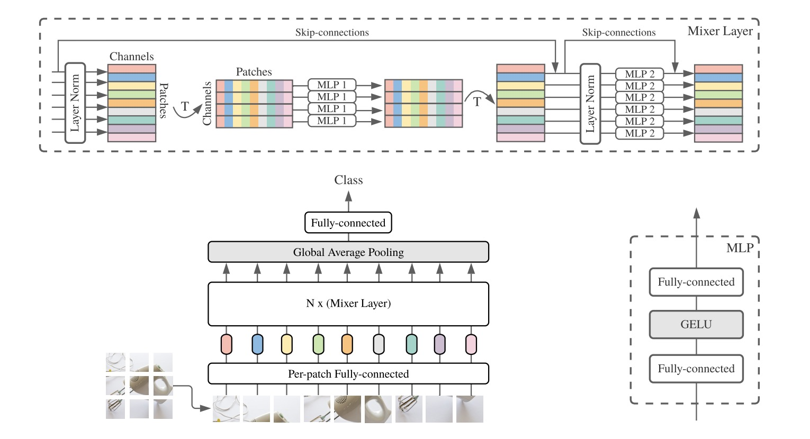

</img>

## MlpMixer - Pytorch

I implemented MlpMixer using pytorch.

Original paper: <a href="https://arxiv.org/pdf/2105.01601.pdf">MLP-Mixer: An all-MLP Architecture for Vision</a>

## Usage MlpMixer

```python
import torch
from MlpMixer.model import  MlpMixer

if __name__ == "__main__":
    model = MlpMixer(in_dim=1, hidden_dim=32,
                     mlp_token_dim=32, mlp_channel_dim=32,
                     patch_size=(7, 7), img_size=(28, 28),
                     num_block=2, num_class=10
                )
    t1 = torch.rand(1, 1, 28, 28)
    print("input: " + str(t1.shape))
    
    # print(net)
    print("output: " + str(model(t1).shape))

```
If the output size is (1, 10), the code runs successfully.


## current examples
1. task_mnist: The simplest example, using the MlpMixer model to classify the minst dataset.

## more
More examples will be updated later.